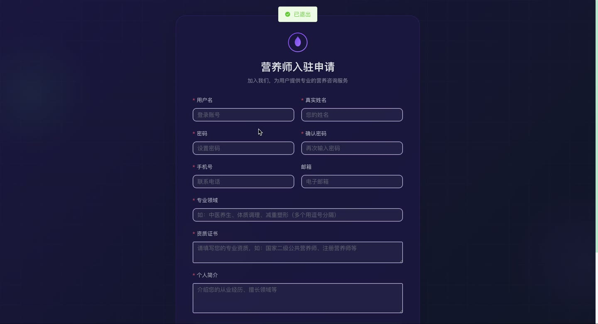
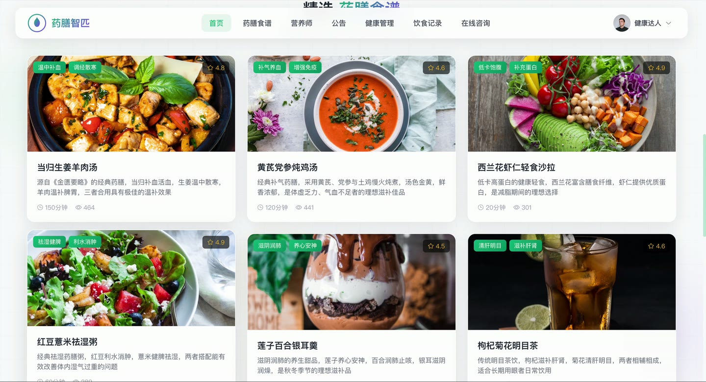
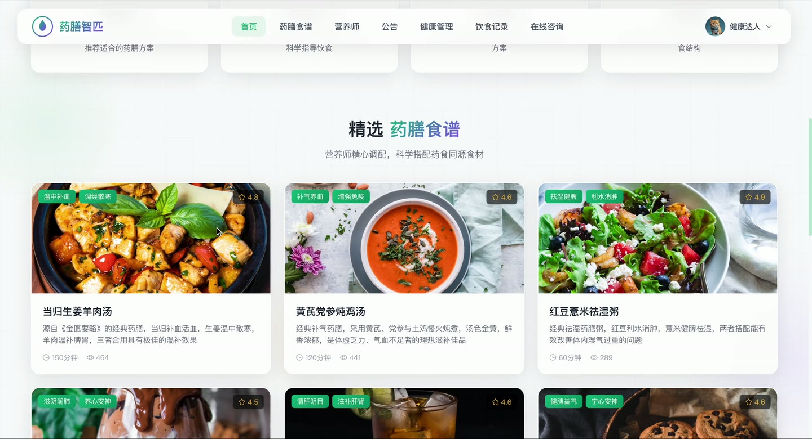
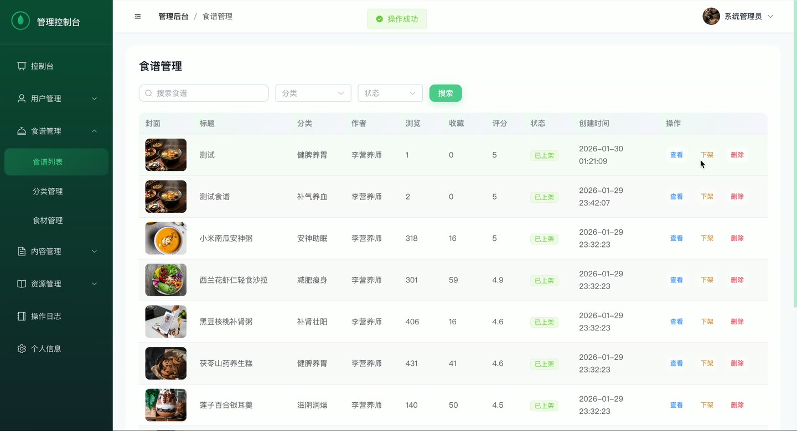
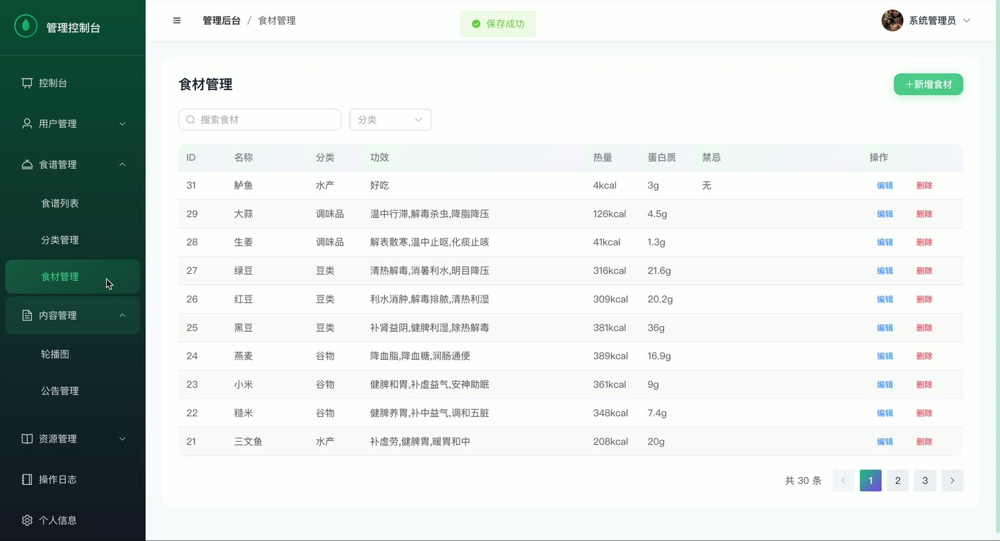

# (附文档)Python+Django+Vue3 药膳食谱智能匹配与营养可视化系统(1)

**技术栈**：Python、Django、Vue3、MySQL

### 系统简介

本系统是一套基于 Python + Django + Vue3 的药膳食谱智能匹配与营养可视化平台，采用前后端分离架构，后端提供 RESTful API，前端为单页应用。系统包含普通用户、营养师、管理员三类角色，围绕药膳食谱浏览收藏、健康画像、饮食记录、营养报告、在线咨询等核心场景构建完整业务闭环。
 
### 核心功能
 
### 普通用户端

 
- 注册与登录：支持用户名或手机号登录，注册时可选择普通用户角色，登录后返回 Token 并有效期 7 天。 
- 个人资料维护：可修改昵称、手机号、邮箱、头像、性别、生日、个人简介，并支持上传头像文件。 
- 修改密码：输入原密码与新密码，校验原密码 MD5 后更新密码。 
- 药膳食谱浏览：按关键词、分类、功效、难度、最大烹饪时长筛选食谱列表，支持按热度、评分、时间排序。 
- 食谱详情查看：查看食谱封面、简介、功效、适宜人群、禁忌、热量与营养数据、食材清单、制作步骤，浏览时自动累加浏览量。 
- 食谱收藏：对食谱进行收藏与取消收藏，查看收藏列表，并校验某食谱是否已收藏。 
- 食谱评论：对食谱发表评论，查看评论列表，删除自己的评论。 
- 食谱分享：对指定食谱执行分享操作，累加分享次数。 
- 食材库浏览：按关键词或分类查询食材，查看食材的功效、禁忌及热量、蛋白质、脂肪、碳水、纤维、维生素、钙铁锌等营养数据。 
- 健康画像维护：填写身高、体重、年龄、体质类型、既往病史、过敏史、饮食偏好、饮食禁忌、健康目标、活动水平，系统自动计算 BMI。 
- 饮食记录管理：按早餐、午餐、晚餐、加餐记录食物名称、份量、图片、热量、蛋白质、脂肪、碳水、纤维及备注，支持编辑与删除。 
- 饮食统计与趋势：按日、周、月统计总热量与各营养素摄入，结合健康画像计算推荐摄入量；按天查看近 7 天营养趋势曲线数据。 
- 营养报告：按日报、周报、月报生成营养报告，自动判定热量、蛋白质、脂肪、碳水状态并给出改善建议，查看报告详情与健康评分。 
- 在线咨询：选择营养师发起咨询会话，发送文本、图片或食谱推荐消息，查看会话列表与消息记录，查看未读消息数。 
- 营养方案查看：查看营养师为自己定制的营养方案及每日每餐对应的食谱安排。 
- 公告与轮播：查看系统公告列表与详情，浏览首页轮播图。 
- 药膳知识库：按关键词、分类查询药膳知识文章，查看知识详情。
 
### 营养师端

 
- 营养师仪表盘：查看我的食谱数、已发布数、待审核数、总浏览量、总收藏量、咨询总数、待回复咨询数、服务用户数、方案数。 
- 食谱发布与管理：创建食谱并填写标题、封面、分类、简介、功效、适宜人群、禁忌、烹饪时长、难度、份数、小贴士、视频及营养数据，同时维护食材清单与制作步骤。 
- 食谱编辑与删除：仅可编辑或删除自己创建的食谱，支持整体替换食材清单与步骤。 
- 食材管理：新增食材并填写功效、禁忌、热量与各类营养素数据，编辑食材信息。 
- 健康画像审核：查看用户健康画像列表，按是否已审核筛选，审核时填写营养师备注。 
- 营养报告点评：查看所有用户营养报告，按用户昵称关键词、是否已点评筛选，对报告填写营养师点评。 
- 营养方案定制：为用户创建营养方案，设置目标热量、蛋白质、脂肪、碳水与方案天数，并配置每日每餐食谱明细。 
- 咨询处理：查看分配给自己的咨询会话，回复用户消息，系统自动统计服务用户数并更新服务次数。 
- 用户列表查看：按关键词、角色、状态查询用户列表。
 
### 管理员端

 
- 管理仪表盘：查看用户总数、营养师总数、待审核营养师数、食谱总数、待审核食谱数、食材总数、咨询总数、今日新增用户与食谱数。 
- 趋势与统计图表：查看近 7 天用户注册趋势、食谱新增趋势、热门食谱 Top5、食谱分类分布统计。 
- 用户管理：新增用户、编辑用户资料与角色状态、重置密码、删除用户，按关键词、角色、状态筛选用户列表。 
- 营养师入驻审核：对申请入驻的营养师执行审核通过或拒绝操作。 
- 食谱审核：对待审核食谱执行通过或驳回操作，审核通过后对上架展示。 
- 食谱分类管理：新增、编辑、删除食谱分类，设置分类名称、图标、排序与状态。 
- 食材管理：编辑食材信息，删除食材。 
- 评论管理：查看评论列表，更新评论内容或状态，删除违规评论。 
- 药膳知识库管理：新增、编辑、删除药膳知识文章，设置标题、分类、摘要、内容与状态。 
- 营养标准管理：维护营养标准数据，支持新增、编辑与删除。 
- 系统配置管理：新增或修改系统配置项，按配置键查询配置详情，删除配置。 
- 公告管理：发布公告并设置公告类型、目标角色、是否置顶，编辑与删除公告。 
- 轮播图管理：新增、编辑、删除轮播图，设置标题、图片、跳转链接、链接类型与排序。 
- 操作日志查看：按用户名或操作内容关键词查询操作日志列表。 
- 文件上传：提供通用文件上传接口，按类型保存至对应目录并返回访问地址。
 
### 技术栈

 后端框架Python + Django + Django REST Framework ORMDjango ORM（聚合 Sum/Avg、TruncDate 日期分组） 权限认证基于 UserToken 的 Token 鉴权，Header Authorization Bearer，按角色 role 控制访问 前端框架Vue3 单页应用 状态管理前端 SPA 路由，静态资源由 Django 转发 构建工具前端构建产物输出至 resources/static，由后端统一托管 数据库MySQL 密码加密MD5 哈希存储 文件存储本地 MEDIA_ROOT 目录，按类型分目录保存
 
### 交付内容

 
- 后端完整源码 
- 前端完整源码 
- 数据库初始化脚本 
- 万字文档

## 界面展示

---

## 获取完整源码 + 万字文档

本仓库为项目介绍页。**完整前后端源码、数据库初始化脚本、万字项目文档**，请加微信 `kangkangcode`，或访问 [codekk.top](http://codekk.top) 获取。

可作课程设计 / 毕业设计参考，支持远程部署调试。